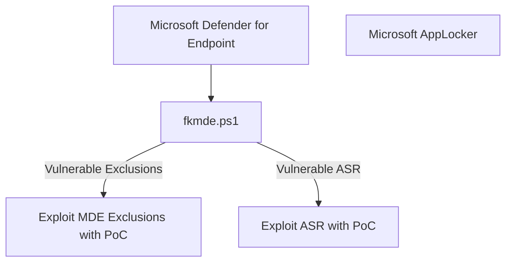

# fkxdr-mindmaps for exploiting and bypassing EDR

Hello friend, how are you?

This is a small place about hosting my personal techniques needed for real-life scenarios, focused on EDR and XDR.

#### Initial Defender Enumeration
[ ] Check if Microsoft Defender Antivirus is running with fkmde  
  
#### Smart Screen
[ ] Smart Screen Test: https://commandcontrol.smartscreentestratings.com/  
[ ] Smart Screen Test: https://smartscreentestratings2.net  
[ ] Smart Screen Phishing: https://demo.smartscreen.msft.net/phishingdemo.html  
[ ] Smart Screen Malware: https://demo.smartscreen.msft.net/other/malware.html  
[ ] Smart Screen Untrusted: https://demo.smartscreen.msft.net/download/malwaredemo/freevideo.exe  
[ ] Smart Screen Exploit: https://demo.smartscreen.msft.net/other/exploit.html  

