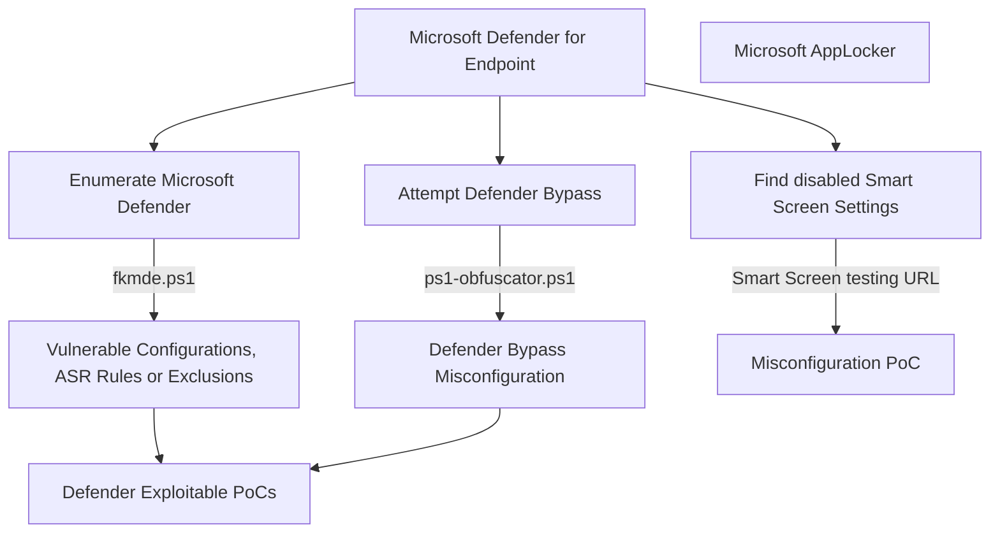

# fkxdr-mindmaps for exploiting and bypassing EDR/XDR

This is a small place about hosting my personal techniques needed for real-life scenarios, focused on EDR and XDR.
  

## Table of Contents
Enumeration of MDE
* [Smart Screen](#Smart-Screen)  

## Enumeration of MDE
### Smart Screen

A collection of smart screen test links.

* Smart Screen Test: https://commandcontrol.smartscreentestratings.com/  
* Smart Screen Test: https://smartscreentestratings2.net  
* Smart Screen Phishing: https://demo.smartscreen.msft.net/phishingdemo.html  
* Smart Screen Malware: https://demo.smartscreen.msft.net/other/malware.html  
* Smart Screen Untrusted: https://demo.smartscreen.msft.net/download/malwaredemo/freevideo.exe  
* Smart Screen Exploit: https://demo.smartscreen.msft.net/other/exploit.html  
